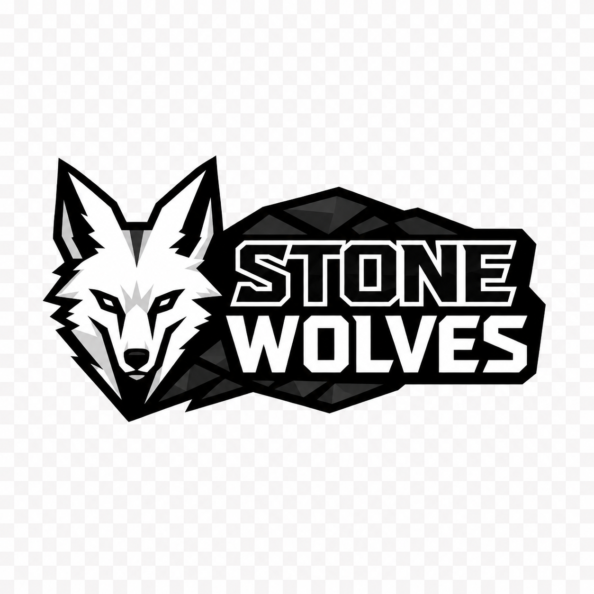
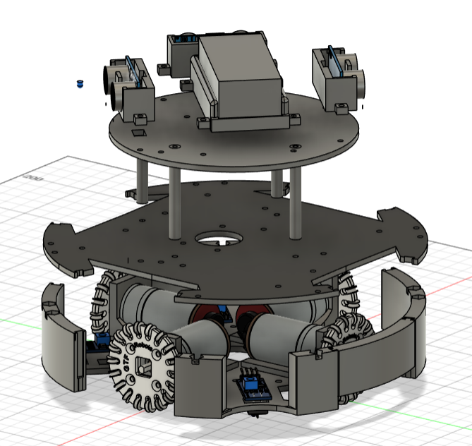
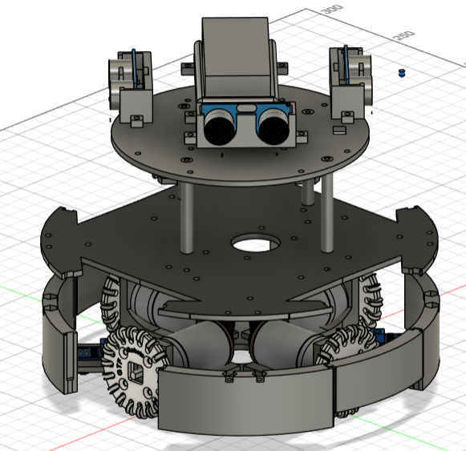
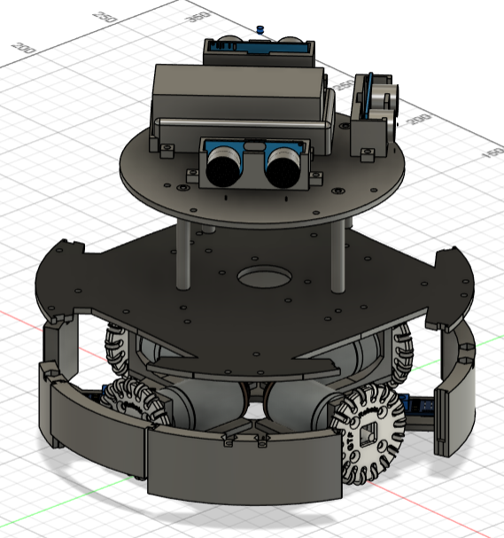
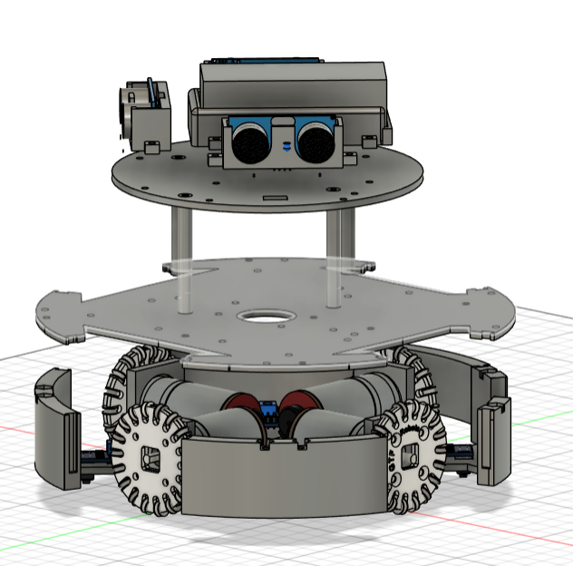
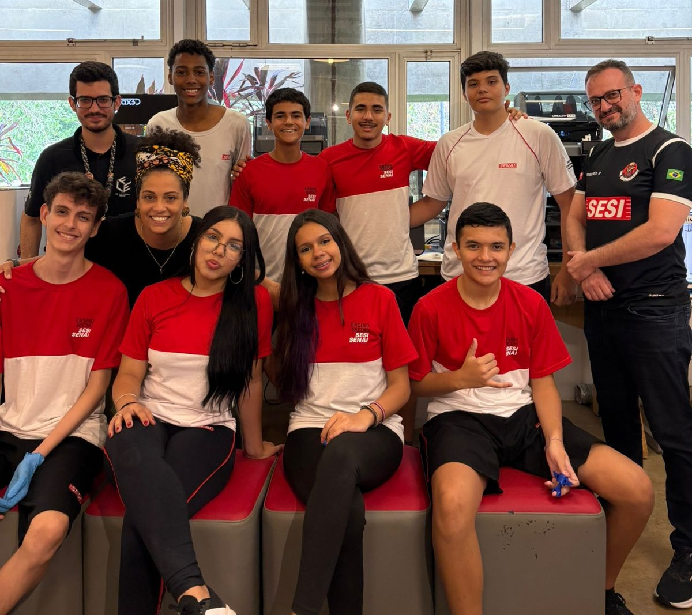

<h1 align=center>Robocup-Soccer-2026</h1>

  
  
  
  

<h2 align=center>Team Name</h2>

Stone Wolves

<h3 align=center>Logo</h3>

<h2 align=center>Where the Team Was Founded</h2>

Ribeirão Preto, São Paulo, Brazil 🇧🇷

<h2 align=center>Robot Images</h2>

  
   
  Front view of the robot modeled in Fusion

  
   
  Back view of the robot modeled in Fusion

  
   
  Left-side view of the robot modeled in Fusion

  
   
  Right-side view of the robot modeled in Fusion

<h2 align=center>Team Members</h2>

<ul align=center>
  <li>Cauã Moraes</li>
  <li>Felipe Siqueira</li>
  <li>Luana Bazan</li>
  <li>Luiz Henrique</li>
  <li>Nicolas Bermudes</li>
  <li>Nicoly Aguiar</li>
  <li>Raul Furlan</li>
  <li>Samuel Brito</li>
</ul>

<h2 align=center>Coach</h2>

Yuri Rezende

<h2 align=center>Team Photo</h2>

  
   
  Team Picture

<h2 align=center>About the Project</h2>

Stone Wolves is a robotics soccer team created to participate in RoboCup Soccer Infrared 2026.
Our objective is to develop autonomous robots capable of playing soccer through programming, mechanics, and electronics.

<h2 align=center>Technologies Used</h2>

<ul align=center>
  <li>Fusion 360</li>
  <li>Arduino IDE</li>
  <li>ESP32 (Communication via ESP-NOW)</li>
</ul>

<h2 align=center>Robot Video</h2>

Watch our robot playing.

  <a href="Video_Robô.mp4">▶ Watch the Video</a>

  

